# Artificial Intelligence for Trading Nanodegree

# Portfolio Optimization

## Project: Smart-Beta and Portfolio Optimization

## Table of Contents

1. [Project Overview](#overview)
2. [Project Description](#description)
3. [Data](#data)
4. [Part 1: Smart Beta Portfolio](#smart-beta)
    1. [Index Weights](#index_weights)
    2. [Portfolio Weights](#portfolio_weights)
    3. [Returns](#rets)
    4. [Weighted Returns](#weighted_rets)
    5. [Cumulative Returns](#cum_rets)
    6. [Tracking Error](#error)
5. [Part 2: Portfolio Optimization](#portfolio_opt)
    1. [Covariance](#cov)
    2. [Optimized Portfolio](#opt_portfolio)
    3. [Rebalance Portfolio Over Time](#rebalance)
    4. [Portfolio Turnover](#turnover)
6. [Files](#files)
7. [Libraries](#lib)

<a id='overview'></a>

### Project Overview

**Smart beta** has a broad meaning, but we can say in practice that when we use the universe of stocks from an index, and then apply some weighting scheme **other than market cap weighting**, it can be considered a type of **smart beta fund**.  A Smart Beta portfolio generally gives investors exposure or "beta" to one or more types of market characteristics (or factors) that are believed to predict prices while giving investors a diversified broad exposure to a particular market. Smart Beta portfolios generally target momentum, earnings quality, low volatility, and dividends or some combination.

Smart Beta Portfolios are generally rebalanced infrequently and follow relatively simple rules or algorithms that are passively managed.  Model changes to these types of funds are also rare requiring prospectus filings with US Security and Exchange Commission in the case of US focused mutual funds or ETFs.. Smart Beta portfolios are generally long-only, they do not short stocks.

In contrast, a purely alpha-focused quantitative fund may use multiple models or algorithms to create a portfolio. The portfolio manager retains discretion in upgrading or changing the types of models and how often to rebalance the portfolio in attempt to maximize performance in comparison to a stock benchmark.  Managers may have discretion to short stocks in portfolios.

Imagine we're a portfolio manager, and wish to try out some different portfolio weighting methods.

One way to design portfolio is to look at certain accounting measures (fundamentals) that, based on past trends, indicate stocks that produce better results.  

For instance, we may start with a hypothesis that dividend-issuing stocks tend to perform better than stocks that do not. This may not always be true of all companies; for instance, Apple does not issue dividends, but has had good historical performance.  The hypothesis about dividend-paying stocks may go something like this: 

>Companies that regularly issue dividends may also be more prudent in allocating their available cash, and may indicate that they are more conscious of prioritizing shareholder interests.  For example, a CEO may decide to reinvest cash into pet projects that produce low returns.  Or, the CEO may do some analysis, identify that reinvesting within the company produces lower returns compared to a diversified portfolio, and so decide that shareholders would be better served if they were given the cash (in the form of dividends).  So according to this hypothesis, dividends may be both a proxy for how the company is doing (in terms of earnings and cash flow), but also a signal that the company acts in the best interest of its shareholders.  Of course, it's important to test whether this works in practice.

We may also have another hypothesis, with which we wish to design a portfolio that can then be made into an ETF. We may find that investors may wish to invest in passive beta funds, but wish to have less risk exposure (less volatility) in their investments.  The goal of having a low volatility fund that still produces returns similar to an index may be appealing to investors who have a shorter investment time horizon, and so are more risk averse.

So the objective of this proposed portfolio is to design a portfolio that closely tracks an index, while also minimizing the portfolio variance.  Also, if this portfolio can match the returns of the index with less volatility, then it has a higher risk-adjusted return (same return, lower volatility).

Smart Beta ETFs can be designed with both of these two general methods (among others): alternative weighting and minimum volatility ETF.

<a id='description'></a>

### Project Description

In this project, I will build a smart beta portfolio and compare it to a benchmark index. To find out how well the smart beta portfolio did, I'll calculate the tracking error against the index. I'll then build a portfolio by using **quadratic programming** to optimize the weights. My code will rebalance this portfolio and calculate turn over to evaluate the performance. I'll use this metric to find the optimal rebalancing Frequency.

<a id='data'></a>

### Data

For the dataset, we'll be using the end of day from [Quotemedia](https://www.quotemedia.com).

Udacity doesn't have a license to redistribute the data to us. They are working on alternatives to this [problem](https://github.com/udacity/artificial-intelligence-for-trading/#no-data).

This is how the data looks like:

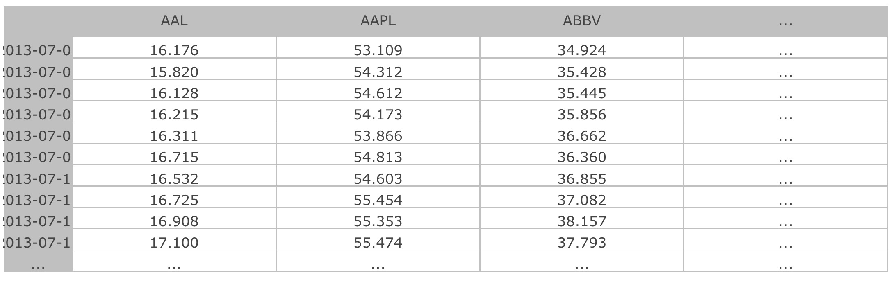

<a id='smart-beta'></a>

### Part 1: Smart Beta Portfolio

In Part 1 of this project, I'll build a portfolio using dividend yield to choose the portfolio weights. A portfolio such as this could be incorporated into a smart beta ETF.  I'll compare this portfolio to a market cap weighted index to see how well it performs. 

>Note that in practice, you'll probably get the index weights from a data vendor (such as companies that create indices, like MSCI, FTSE, Standard and Poor's), but for this exercise we will simulate a market cap weighted index.

<a id='index_weights'></a>

#### Index Weights

The function `generate_dollar_volume_weights` in cell no. 5 does this task.

This is what our simulated **index weights** look like:

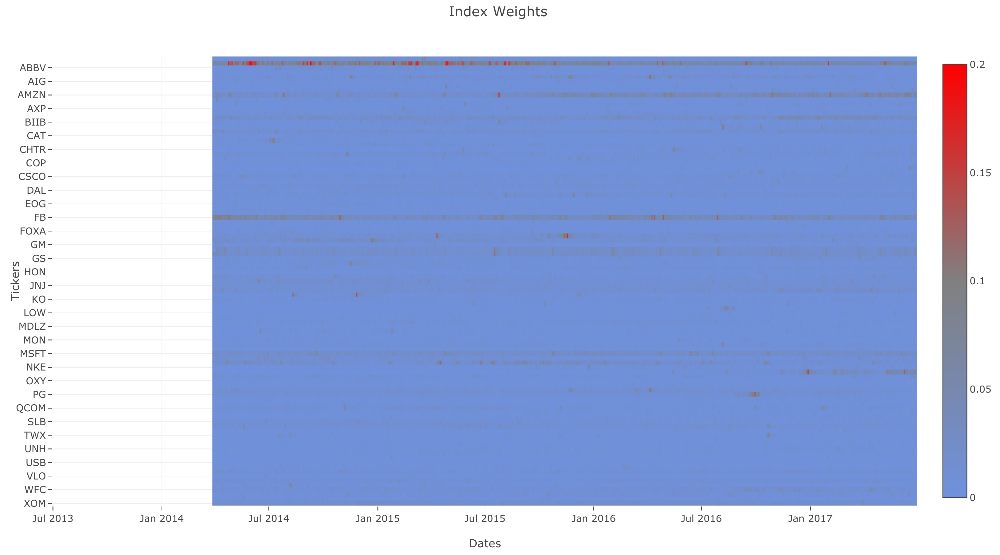

<a id='portfolio_weights'></a>

#### Portfolio Weights

Now that we have the index weights, let's choose the portfolio weights based on dividend. We would normally calculate the weights based on trailing dividend yield, but we'll simplify this by just calculating the total dividend yield over time.

The function `calculate_dividend_weights` in cell no. 7 does this task.

Just like the index weights, let's see the ETF weights:

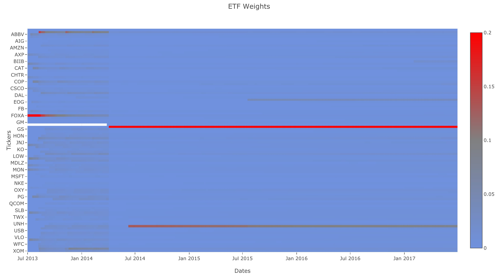

<a id='rets'></a>

#### Returns

The function `generate_returns` in cell no. 9 generates returns data for all the stocks and dates from price data. You might notice we're implementing returns and not log returns. Since we're **not dealing with volatility**, we don't have to use log returns.

Here is the heatmap of returns for daily closing price:

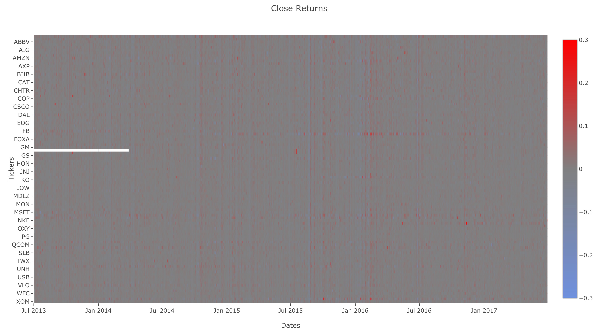

<a id='weighted_rets'></a>

#### Weighted Returns

With the returns of each stock computed, we can use it to compute the returns for an index or ETF.

The function `generate_weighted_returns` in cell no. 11 creates weighted returns using the **returns** and **weights dataframe**.

Here is what ETF and index returns look like:

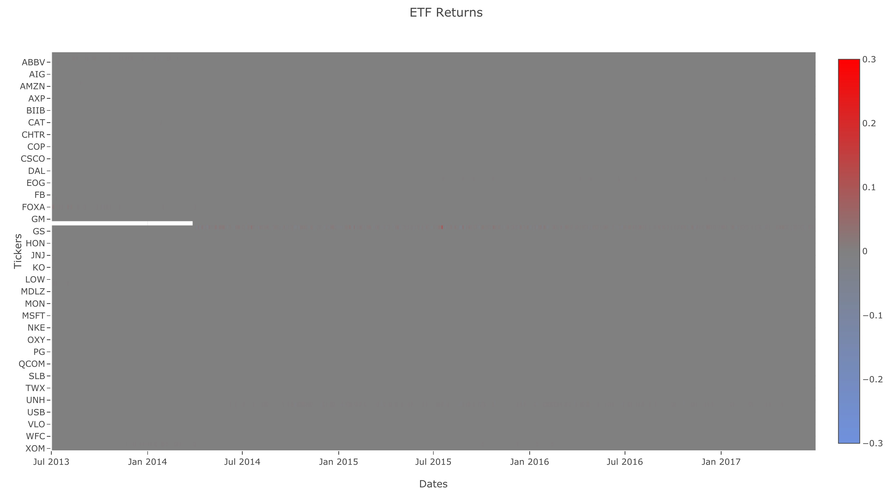
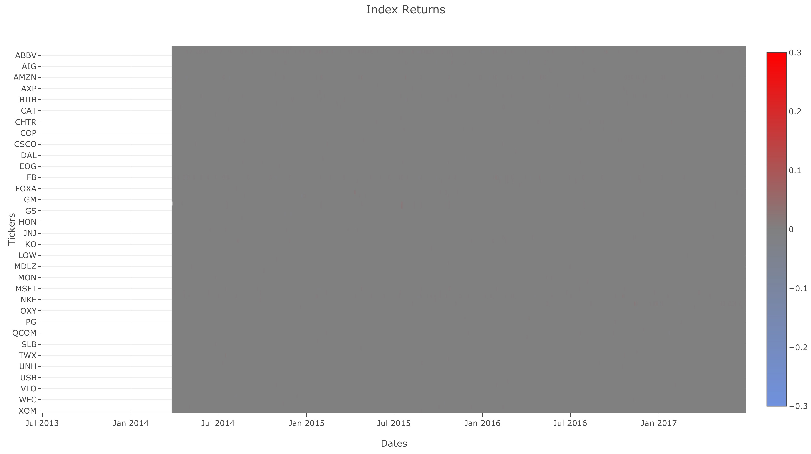

<a id='cum_rets'></a>

#### Cumulative Returns

To compare performance between the ETF and Index, we're going to calculate the tracking error. Before we do that, we first need to calculate the index and ETF cumulative returns.

The function `calculate_cumulative_returns` in cell no. 13 calculates the cumulative returns over time given the returns.

Let's generate the ETF and index cumulative returns using `calculate_cumulative_returns` and compare the two.

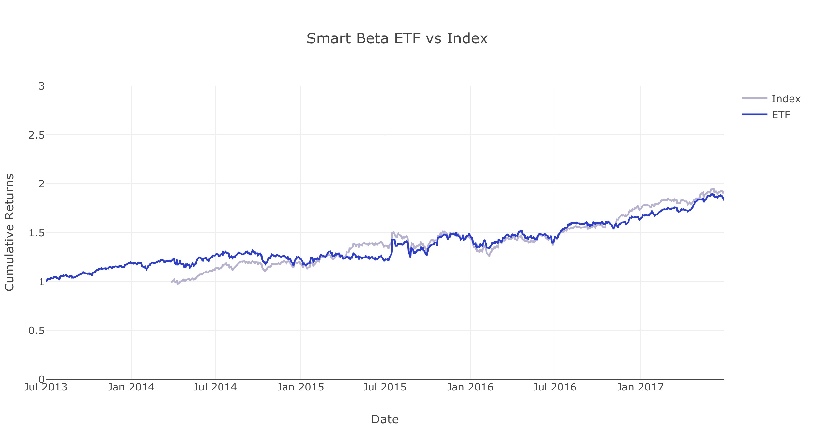

<a id='error'></a>

#### Tracking Error

In order to check the performance of the smart beta portfolio, we can calculate the annualized tracking error against the index.

The function `tracking_error` in cell no. 15 returns the tracking error between the ETF and benchmark.

For reference, we'll be using the following annualized tracking error function:

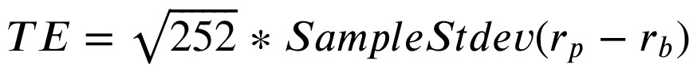

Where _r<sub>p</sub>_ is is the portfolio/ETF returns and _r<sub>b</sub>_ is the benchmark returns.

>Note: When calculating the sample standard deviation, the delta degrees of freedom is 1, which is the also the default value.

Now let's generate the tracking error using this function:

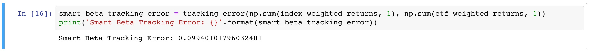

<a id='portfolio_opt'></a>

### Part 2: Portfolio Optimization

Now, let's create a second portfolio.  We'll still reuse the market cap weighted index, but this will be independent of the dividend-weighted portfolio that we created in [Part 1](#portfolio_weights).

We want to both minimize the portfolio variance and also want to closely track a market cap weighted index.  In other words, we're trying to minimize the distance between the weights of our portfolio and the weights of the index.

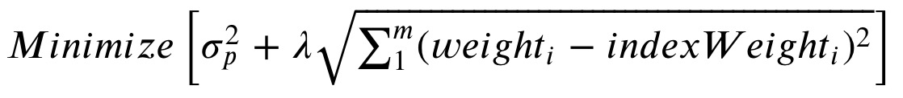

where _m_ is the number of stocks in the portfolio, and ? is a scaling factor that we can choose.

Why are we doing this? One way that investors evaluate a fund is by how well it tracks its index. The fund is still expected to deviate from the index within a certain range in order to improve fund performance.  A way for a fund to track the performance of its benchmark is by keeping its asset weights similar to the weights of the index.  We’d expect that if the fund has the same stocks as the benchmark, and also the same weights for each stock as the benchmark, the fund would yield about the same returns as the benchmark. By minimizing a linear combination of both the portfolio risk and distance between portfolio and benchmark weights, we attempt to balance the desire to minimize portfolio variance with the goal of tracking the index.

<a id='cov'></a>

#### Covariance

The function `get_covariance_returns` calculates the covariance of the `returns`. This helps to calculate the portfolio variance.

The covariance matrix **P** is:

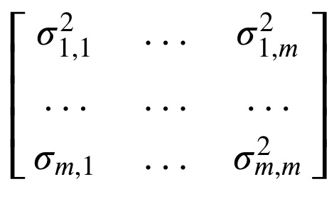

Now, let's look at the covariance generated from `get_covariance_returns`:

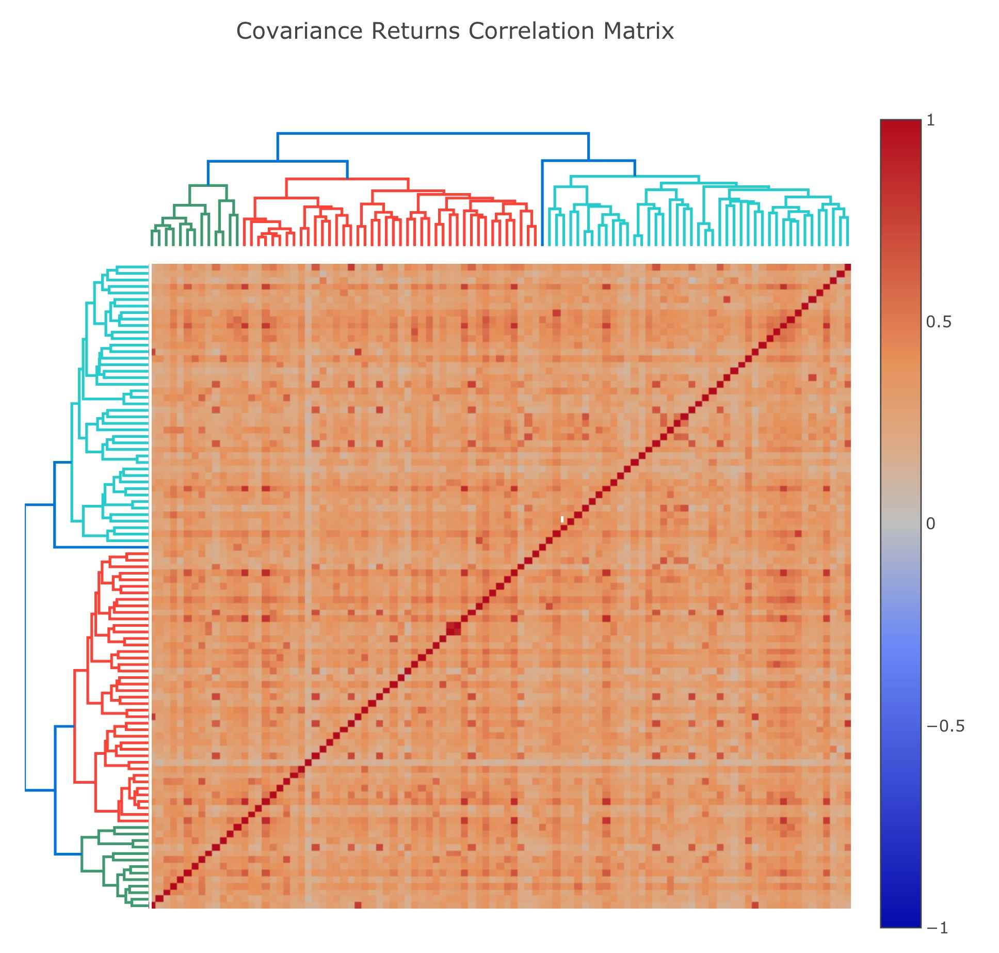

<a id='opt_portfolio'></a>

#### Optimized Portfolio

Now let's compare our ETF returns with index returns:

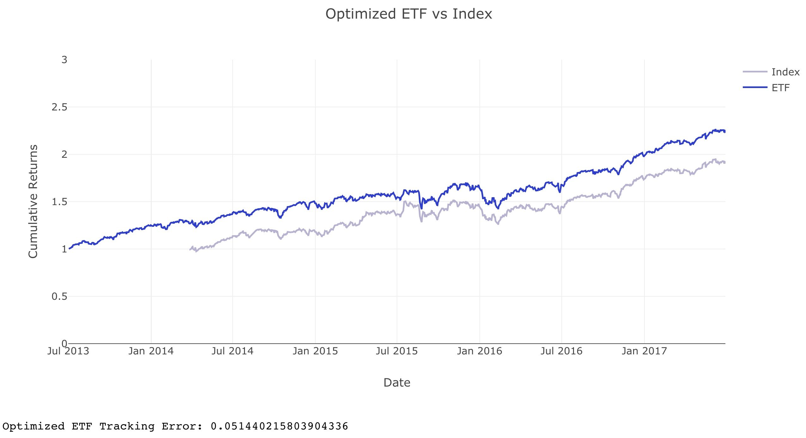

<a id='rebalance'></a>

#### Rebalance Portfolio Over Time

The single optimized ETF portfolio used the same weights for the entire history. This might not be the optimal weights for the entire period. We will rebalance the portfolio over the same period instead of using the same weights.

The function `rebalance_portfolio` in cell no. 22 does this task. It rebalances the portfolio every _**n**_ number of days, which is given as `shift_size`. When rebalancing, it looks back a certain number of days of data in the past, denoted as `chunk_size`. Using this data, it computes the optimal weights using `get_optimal_weights` (cell no. 19) and `get_covariance_returns` (cell no. 17).

We use the following arguments when rebalancing our portfolio:

```python
chunk_size = 250
shift_size = 5
all_rebalance_weights = rebalance_portfolio(
    returns,
    index_weights,
    shift_size,
    chunk_size
    )
```

<a id='turnover'></a>

#### Portfolio turnover

With the portfolio rebalanced, we need to use a metric to measure the cost of rebalancing the portfolio. The function `get_portfolio_turnover` in cell no. 24 calculates the annual portfolio turnover. Thes turnover formulas were used used in class:

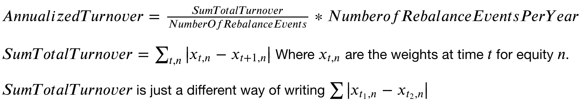

<a id='files'></a>

### Files

- _Graph_ folder contains plots (interactive) generated when implementing functions on input data.
- _img_ folder contains screenshots of the plots above for documentation purpose.
- `helper.py`, `project_helper.py`, `project_tests.py` and `tests.py` are helper files which provide visualizations and unit tests.
- `project_3_starter.ipynb` is the notebook where I completed the project
- `project_3_starter.html` is just the HTML export of it.

<a id='lib'></a>

### Libraries

Necessary libraries are mentioned in `requirements.txt`.